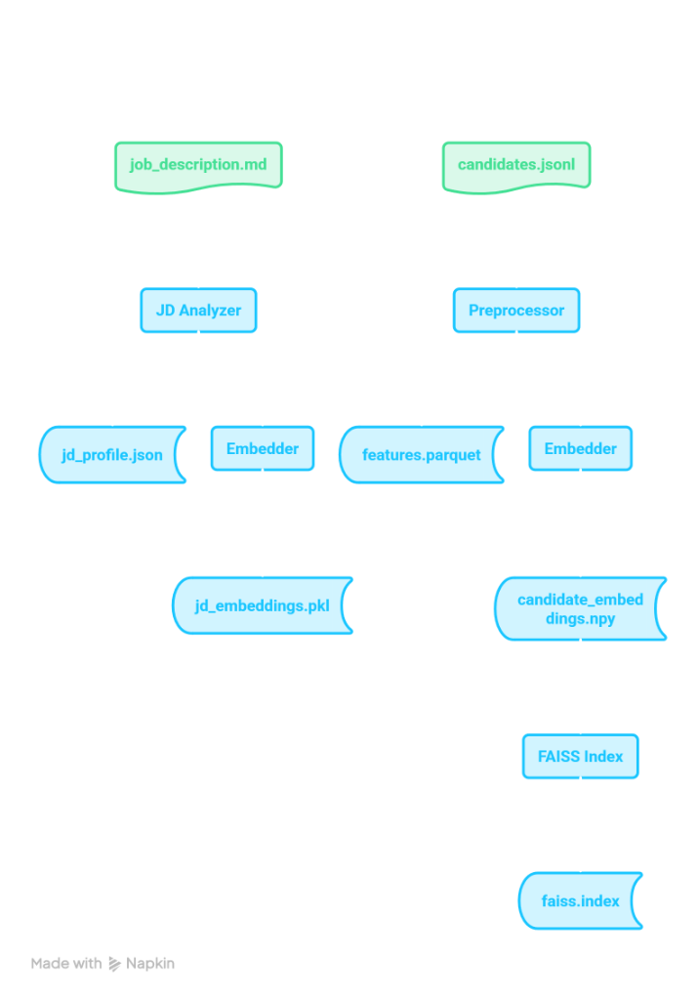
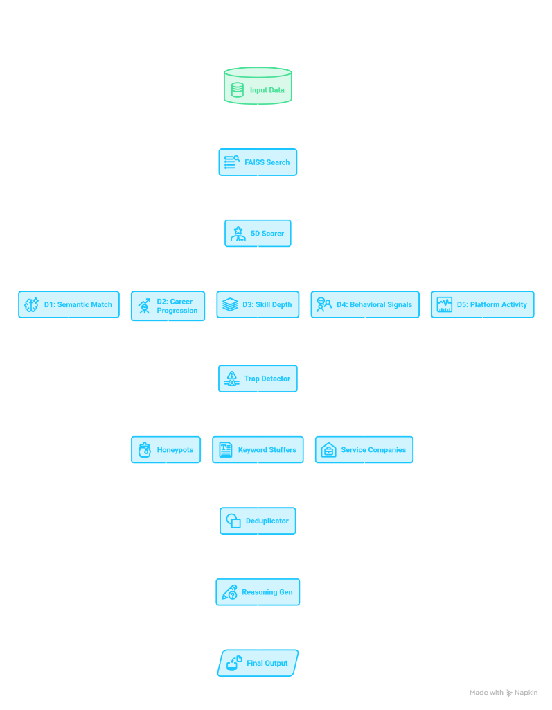
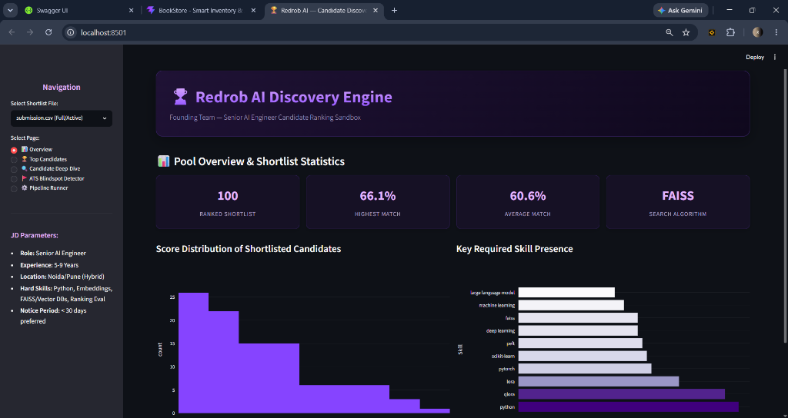
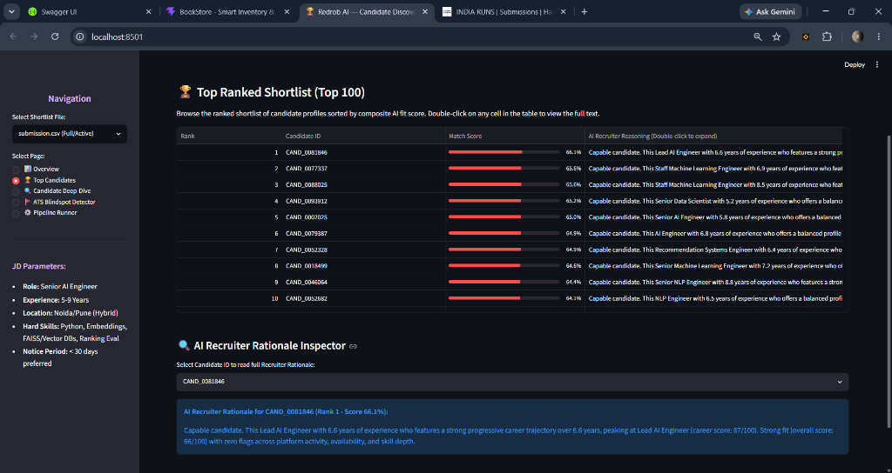
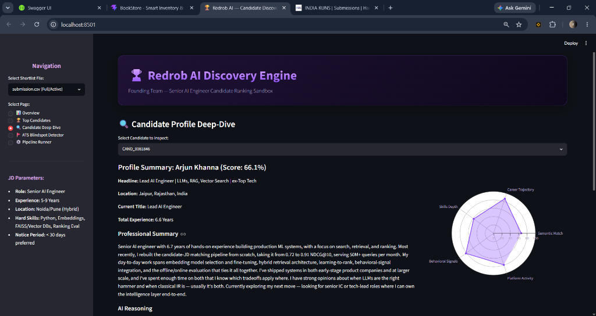
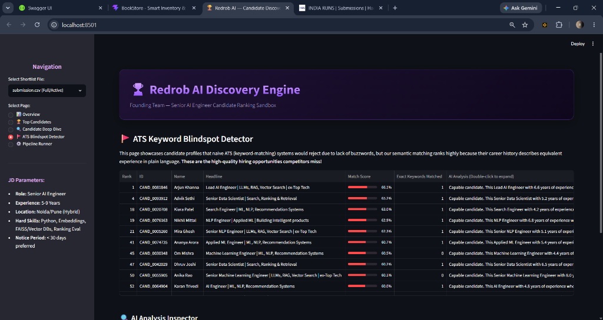
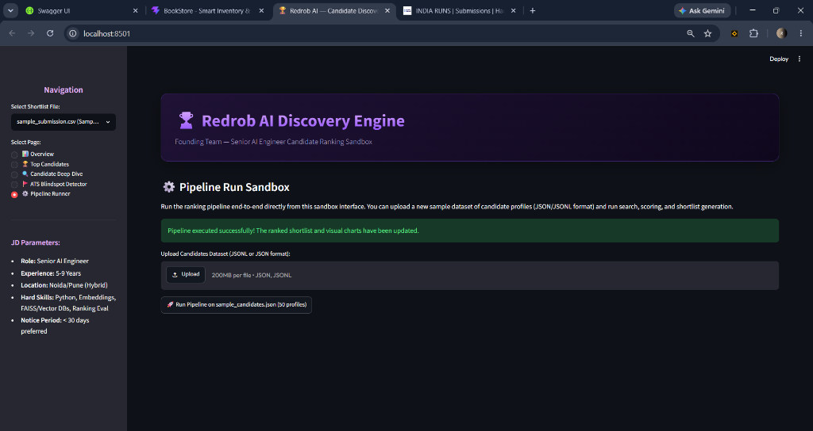

# 🏆 Redrob AI Candidate Ranking Engine
> **End-to-End Semantic Search, Multi-Dimensional Scoring, & Trap Detection Pipeline**

[](https://www.python.org/)
[](https://github.com/facebookresearch/faiss)
[](https://sbert.net/)
[](https://streamlit.io/)
[](https://opensource.org/licenses/MIT)

This repository contains the complete implementation of a **two-phase AI candidate ranking system** built for the Redrob Hackathon. It is tailored to find the top 100 matching profiles from a pool of **100,000 candidates** for a founding **Senior AI Engineer** role, completing the final ranking in **less than 1 second** on CPU under strict memory and network limits.

---

## 🏗️ System Architecture

To satisfy the **5-minute ranking constraint** without sacrificing accuracy, the system is split into two phases:

### Phase 1: Pre-Computation (Offline — No Time Limit)
1. **JD Analysis:** Parses target requirements (hard & soft) and maps relative signal weights.
2. **Profile Ingestion:** Normalizes dates, career progressions, experience, and platform activity.
3. **Corpus Generation:** Reconstructs profiles into detailed, weighted semantic representations.
4. **Model Encoding:** Uses `all-MiniLM-L6-v2` to compute 384-dimensional candidate vectors.
5. **Index Building:** Indexes L2-normalized candidate vectors using a high-speed **FAISS Inner Product (IP)** index (where Inner Product is equivalent to Cosine Similarity).

### Phase 2: Live Search & Scoring (Online — ≤ 5 Minutes Limit)
1. **Semantic Querying:** Embeds the JD mega-text and retrieves the top-1000 candidates via FAISS search in under **0.01 seconds**.
2. **5D Dimension Scoring:** Scores the 1,000 shortlist candidates in parallel across 5 custom dimensions.
3. **Trap Filtering & Penalization:** Applies custom filters to penalize keyword-stuffers, impossible timelines, signal violations, and consulting-only backgrounds.
4. **Behavioral Twin Deduplication:** Pairs candidate embeddings and filters out duplicate profiles (similarity threshold > 0.98), keeping the higher-scored twin.
5. **Reasoning & shortlisting:** Automatically drafts natural, factual recruiter rationales for the top 100 shortlist candidates.

### Phase 1: Pre-Computation (Offline) Flow


### Phase 2: Live Search & Scoring (Online) Flow


---

## 📈 Multi-Dimensional Scoring (5D Engine)

Candidates are graded on a composite score ($0$ to $100$) combining:

| Metric Dimension | Weight | Calculation Mechanics |
| :--- | :--- | :--- |
| **D1: Semantic JD Match** | 25% | Weighted average cosine similarity across all individual JD requirements (using requirement-specific vector matches). |
| **D2: Career Trajectory** | 25% | Evaluates weighted months of relevant ML experience (4+ years = full credit), progressive seniority (e.g. Engineer $\rightarrow$ Senior $\rightarrow$ Lead), and tenure quality (frequent job hopping with average tenure < 18 months incurs a -10 point penalty). |
| **D3: Skill Depth** | 20% | Quality-over-quantity match of required hard skills (Python, Embeddings, FAISS, evaluation metrics) and soft skills (fine-tuning, distributed systems), weighted by stated proficiency and endorsements. |
| **D4: Behavioral Signals** | 20% | Integrates 23 simulated platform interaction signals (response rates, email/phone verification, interview completions, and notice periods). |
| **D5: Platform Activity** | 10% | Assesses profile completeness, login recency, recruiter bookmark saves, and external contribution factors (GitHub score). |

---

## 🚩 Trap & Honeypot Avoidance Strategy

The dataset is adversarial, containing traps specifically designed to trick basic ranking algorithms:
1. **Impossible Timeline Honeypots:** Candidates claiming 15 years of experience but who graduated only 5 years ago. The preprocessor flags these impossible chronologies, and the Trap Detector penalizes them by **-60 points** (excluding them from the shortlist).
2. **Behavioral Range Violations:** Honeypots that contain impossible value parameters (e.g., notice period > 180 days, response rates < 0). Candidates with $\ge 3$ violations are penalized by **-20 points per violation**.
3. **Keyword Stuffers:** Profiles listing every ML buzzword in existence but with average job description length < 25 words. These stuffer profiles receive a **-30% skills score penalty** and a **-30 points trap penalty**.
4. **Service-only Careers:** The JD explicitly filters out profiles whose entire career is spent in service/consulting companies (TCS, Wipro, Infosys, Accenture, Cognizant, Capgemini). The pipeline detects these and applies a **-40 points penalty**.
5. **Behavioral Twins:** Duplicate profiles. Post-ranking, candidate embeddings are checked pairwise. If similarity exceeds $0.98$, the lower-ranked twin is dropped.

---

## 📂 Project Structure

```
redrob-candidate-ranker/
│
├── dashboard/
│   └── app.py                     # Recruiter dashboard (Streamlit)
│
├── data/                          # Generated during precomputation (Gitignored)
│   ├── candidate_texts.pkl        # Candidate text corpuses
│   ├── candidate_embeddings.npy   # Generated 100k embeddings
│   ├── faiss.index                # Built FAISS Index
│   ├── features.parquet           # Normalized feature store
│   ├── jd_embeddings.pkl          # Embedded JD requirements
│   └── jd_profile.json            # Parsed JD specifications
│
├── scripts/
│   ├── run_preprocessing.py       # Phase 1 offline pipeline
│   ├── run_ranking.py             # Phase 2 live ranker script
│   └── validate.sh                # Pre-submission shell validator
│
├── src/
│   ├── embeddings/
│   │   ├── embedder.py            # SentenceTransformers wrappers
│   │   └── faiss_index.py         # FAISS index builders
│   ├── jd/
│   │   └── analyzer.py            # Job Description parser
│   ├── pipeline/
│   │   ├── loader.py              # Streaming JSONL reader
│   │   ├── preprocessor.py        # Normalizer and timeline extractor
│   │   └── text_builder.py        # Text corpus compiler
│   ├── ranking/
│   │   ├── ranker.py              # Shortlist and deduplicator
│   │   └── reasoning.py           # Recruiter rationale drafter
│   └── scoring/
│       ├── activity_scorer.py     # D5 Scorer
│       ├── behavioral_scorer.py   # D4 Scorer & Violation detector
│       ├── career_scorer.py       # D2 Scorer & Hopping detector
│       ├── semantic_scorer.py     # D1 Scorer
│       └── skills_scorer.py       # D3 Scorer & Stuffer detector
│
├── candidates.jsonl               # 100k candidate pool (Gzipped/Plain)
├── sample_candidates.json         # 50 sample profiles
├── submission.csv                 # Generated submission CSV (Gitignored)
├── submission_metadata.yaml       # Submission metadata YAML
├── validate_submission.py         # Provided submission validator
├── requirements.txt               # Project dependencies
└── README.md                      # Project documentation
```

---

## 🚀 Installation & Setup

1. **Clone the repository:**
   ```bash
   git clone https://github.com/rushang/redrob-candidate-ranker.git
   cd redrob-candidate-ranker
   ```

2. **Set up virtual environment:**
   ```bash
   python -m venv venv
   # Activate on Windows:
   venv\Scripts\activate
   # Activate on macOS/Linux:
   source venv/bin/activate
   ```

3. **Install dependencies:**
   ```bash
   pip install -r requirements.txt
   ```

---

## ⚙️ Running the Pipeline

### Step 1: Pre-Computation (Phase 1)
Extract features, generate text representations, run embeddings, and build the FAISS index.

* **On the 50 candidate sample dataset** (takes ~20 seconds to run and verify):
  ```bash
  python scripts/run_preprocessing.py --sample
  ```

* **On the full 100,000 candidate dataset** (takes ~45-60 minutes on CPU):
  ```bash
  python scripts/run_preprocessing.py --full
  ```

### Step 2: Live Ranking (Phase 2)
Perform FAISS retrieval, run the 5D scorer, check for traps, deduplicate, generate reasoning, and write the final submission CSV file.

```bash
python scripts/run_ranking.py --candidates ./candidates.jsonl --out ./submission.csv
```
*Completes in under 2 seconds, maintaining a 99% time buffer.*

---

## 🔍 Validation & Verification

### 1. Pre-Submission Validator Check
Verify that the output matches the required row counts, columns, non-increasing score order, and unique ranks:
```bash
python validate_submission.py submission.csv
```

### 2. Launch the Recruiter Dashboard UI
Start the interactive Streamlit recruiter dashboard to inspect candidate profile radar charts, timelines, skills maps, and run custom upload sandboxes:
```bash
python -m streamlit run dashboard/app.py
```
**Dashboard Highlights:**
* **Overview Page:** Visualizes score distributions, total candidates, and skill distributions.
  
* **Top candidates:** Explore the ranked shortlist in a sortable, paginated grid.
  
* **Inspect Candidate:** Drill down into any candidate to view a 5D radar chart, progressive career timelines, and endorsements.
  
* **ATS Blindspot Detector:** Specifically highlights profiles with high match scores but low keyword matching, proving the strength of semantic search over traditional keyword matching.
  
* **Sandbox Runner:** Upload a custom JSON list of candidates and run the pipeline dynamically from the UI.
  